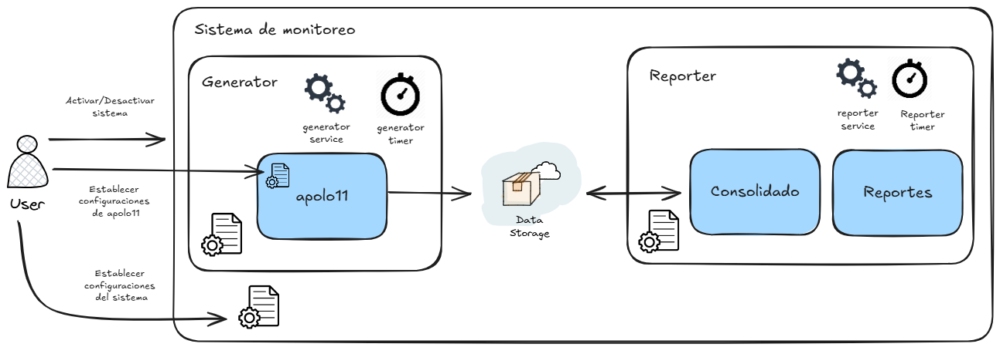
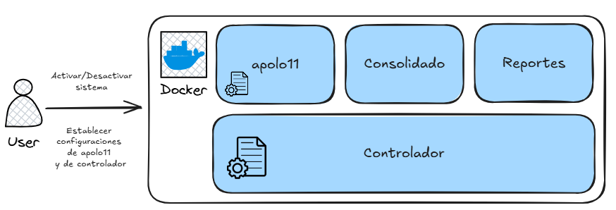

# **Documento de Diseño y Arquitectura: Proyecto Apolo-11**

**Versión:** 1.0
**Fecha:** 26 de mayo de 2024
**Autor:** Selene Solano

---

## **1. Descripción**

Se detallan dos propuestas de arquitectura para la implementación del programa "Apolo-11". El objetivo principal del proyecto es crear un sistema capaz de ejecutar simulaciones y consolidar registros de diversos componentes de misión (satélites, naves, etc.) de forma periódica y automatizada, bajo la operación manual de un comandante.

Se han desarrollado dos enfoques distintos para satisfacer este requerimiento:

1.  **Solución 1:** Una implementación basada en `systemd`, el sistema de inicio y gestión de servicios estándar en linux.
2.  **Solución 2:** Un sistema controlador autónomo basado en un script con un ciclo infinito, diseñado para ser independiente del sistema operativo anfitrión.

Se presentan ambas arquitectura para facilitar la elección de la solución más adecuada según el entorno de despliegue.

## **2. Objetivo del Proyecto Apolo-11**

El programa "Apolo-11" tiene como responsabilidad principal la ejecución de simulaciones y la consolidación de registros generados por un conjunto dinámico de componentes espaciales. El sistema debe ser robusto, escalable para adaptarse a un número variable de componentes y operar de manera cíclica con una frecuencia configurable. La activación y supervisión general del proceso serán realizadas manualmente por el comandante de la misión.

## **3. Propuestas de Arquitectura**

### **3.1. Solución 1: Orquestación con `systemd/systemctl`**

Esta solución aprovecha las capacidades nativas de los sistemas operativos Linux modernos para la gestión de servicios y tareas programadas.

#### **Descripción**

La automatización se logra mediante la combinación de cuatro unidades de `systemd`:

1.  **Unidad de Servicio generador(`generator-apolo11.service`):** Este archivo define *cómo* ejecutar el programa principal de Apolo-11.
2.  **Unidad de Temporizador generador(`apolo-11.timer`):** Este archivo define *cuándo* se debe ejecutar el servicio. Configura la periodicidad de la ejecución y está vinculado directamente a la unidad de servicio.
    - También se puede configurar para activar secuencialmente los servicios del generador y reporter.
3.  **Unidad de Servicio reporter(`reporter-apolo11.service`):** Este archivo define *cómo* ejecutar el programa principal de generación de reportes. 
4.  **Unidad de Temporizador reporter(`reporter-apolo11.timer`):** Este archivo define *cuándo* se debe ejecutar el servicio. Configura la hora de la ejecución y está vinculado directamente a la unidad de servicio.




El usuario interactúa con el sistema a través del comando `systemctl` para habilitar, iniciar, detener o verificar el estado del temporizador, que a su vez controla la ejecución del servicio.


#### **Consideraciones**

*   **Robustez y Fiabilidad:** `systemd` es un sistema probado, estable y diseñado para gestionar procesos de larga duración. Ofrece reinicio automático en caso de fallos del script.
*   **Integración Nativa con el SO:** Se integra perfectamente con el sistema operativo, permitiendo una gestión de logs centralizada a través de `journalctl` y una monitorización estándar.
*   **Eficiencia de Recursos:** No mantiene un proceso de control en un ciclo activo. El sistema operativo "despierta" el proceso solo cuando es necesario, optimizando el uso de CPU.
*   **Gestión Centralizada:** Todas las tareas programadas y servicios del sistema se gestionan desde un único punto de control (`systemctl`).
*   **Dependencia del Entorno:** Requiere un sistema operativo anfitrión que utilice `systemd` (ej. Ubuntu, Debian, CentOS, Fedora). No es portable a otros sistemas operativos o a entornos que no lo incluyan.
*   **Incompatibilidad con Contenedores Ligeros:** Los contenedores Docker estándar no suelen ejecutar un `init system` completo como `systemd`, lo que hace que esta solución no sea directamente aplicable en dichos entornos sin configuraciones complejas.

#### **Ejecución**

1. Clonar el repositorio y acceder a la solución 1:

```bash
git clone https://github.com/SeleneSV/big-data-UNAL.git
cd big-data-UNAL/solucion1
```

2. Seguir las instrucciones del archivo `README.md` dentro del directorio `solucion1`.

---

### **3.2. Solución 2: Sistema Controlador con Ciclo Infinito**

Esta solución fue diseñada con la portabilidad como principal objetivo, eliminando dependencias del sistema operativo anfitrión.

#### **Descripción**

La arquitectura se basa en un script "controlador" que actúa como un orquestador.

1.  **Script Controlador (`controlador.sh`):** Es el punto de entrada. Este script implementa un ciclo infinito (`while True`).
2.  **Lógica del Ciclo:** Dentro del ciclo, el controlador:
    *   Ejecuta el programa principal "Apolo-11" como un subproceso.
    *   Espera a que el subproceso finalice.
    *   Hace una pausa (`sleep`) durante un intervalo de tiempo configurable.
    *   Repite el ciclo.



El usuario inicia manualmente el script controlador, que permanece en ejecución para gestionar el ciclo de vida de Apolo-11.


#### **Consideraciones**

*   **Portabilidad:** Al no tener dependencias externas, esta solución puede ejecutarse en cualquier sistema operativo y es ideal para contenedores.
*   **Simplicidad Conceptual:** La lógica es autocontenida y fácil de entender sin necesidad de conocer sistemas de gestión de servicios específicos.


#### **Ejecución**
1. Clonar el repositorio y acceder a la solución 2:

```bash
git clone https://github.com/SeleneSV/big-data-UNAL.git
cd big-data-UNAL/solucion2
```

2. Seguir las instrucciones del archivo `README.md` dentro del directorio `solucion2`.
