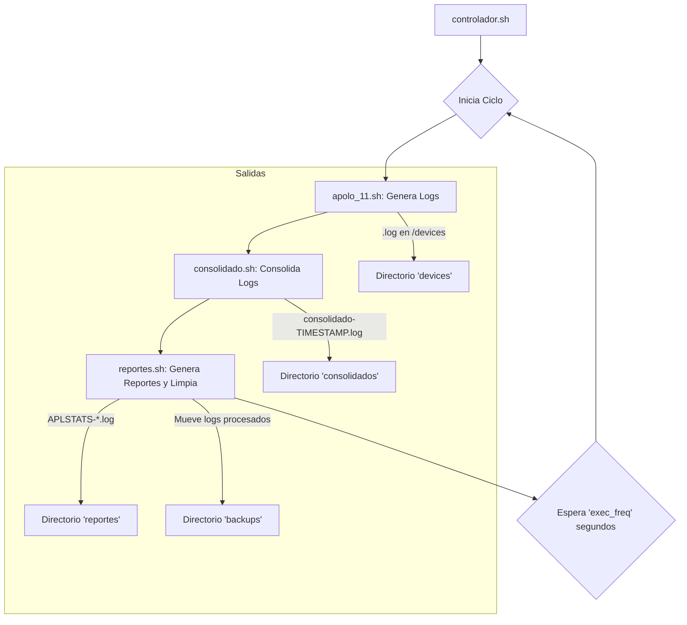

# Apolo 11 - Simulador de Datos y Reportes

Un sistema contenerizado para la simulación, consolidación y reporte de datos de eventos de misiones espaciales. El sistema está diseñado para ejecutarse de forma cíclica, generando datos nuevos en cada iteración y procesándolos para obtener informes analíticos.

## Tabla de Contenidos
- [Descripción General](#descripción-general)
- [Características Principales](#características-principales)
- [Arquitectura del Sistema](#arquitectura-del-sistema)
- [Estructura de Directorios](#estructura-de-directorios)
- [Prerrequisitos](#prerrequisitos)
- [Instalación y Ejecución](#instalación-y-ejecución)
- [Configuración](#configuración)
- [Flujo de Trabajo](#flujo-de-trabajo)
- [Salidas del Sistema](#salidas-del-sistema)

## Descripción General

El proyecto **Apolo 11** es un simulador que genera archivos de log imitando los datos recibidos de diferentes dispositivos en varias misiones espaciales. Posteriormente, estos logs son consolidados en un único archivo, a partir del cual se generan reportes analíticos para la toma de decisiones. Todo el proceso está orquestado por un controlador que se ejecuta en un bucle infinito, asegurando una simulación continua. El sistema está diseñado para correr dentro de un contenedor Docker, facilitando su despliegue y garantizando un entorno de ejecución consistente.

## Características Principales

- **Generación de Datos Simulados**: Crea archivos de log individuales con un formato definido (`date;mission;device_type;device_status;hash`).
- **Consolidación Centralizada**: Agrupa todos los logs generados en un único archivo consolidado por cada ciclo de ejecución.
- **Generación de Reportes Analíticos**: Procesa los datos consolidados para crear múltiples reportes, como análisis de eventos, gestión de desconexiones y estado de las misiones.
- **Configuración Flexible**: Permite ajustar parámetros clave en tiempo real a través de archivos de configuración externos, sin necesidad de modificar los scripts.
- **Contenerizado con Docker**: Empaquetado en una imagen Docker para un despliegue fácil y portable.
- **Gestión de Archivos**: Mueve los logs procesados a un directorio de respaldo para mantener el sistema limpio.

## Arquitectura del Sistema

El sistema se compone de cuatro scripts principales orquestados por un controlador. El flujo de ejecución es el siguiente:



1.  **`controlador.sh`**: Es el punto de entrada. Ejecuta los otros tres scripts en secuencia dentro de un bucle infinito. La frecuencia del bucle es configurable.
2.  **`apolo_11.sh`**: Genera un número aleatorio de archivos de log en el directorio `devices/`. Los datos de cada log (misión, tipo de dispositivo, estado) también son aleatorios, basados en las opciones definidas en su archivo de configuración.
3.  **`consolidado.sh`**: Lee todos los archivos `.log` del directorio `devices/` y los combina en un único archivo `consolidado-TIMESTAMP.log` en el directorio `consolidados/`.
4.  **`reportes.sh`**: Toma el archivo consolidado más reciente, genera varios reportes analíticos en el directorio `reportes/` y, finalmente, mueve los logs originales de `devices/` al directorio `backups/` para evitar que sean procesados de nuevo.

## Estructura de Directorios

La estructura esperada del proyecto es la siguiente:

```
.
├── apolo_11.config         # Configuración para el generador de datos.
├── apolo_11.sh             # Script para generar logs de misiones.
├── controlador.conf        # Configuración para el controlador.
├── controlador.sh          # Script principal que orquesta el flujo.
├── consolidado.sh          # Script para consolidar los logs generados.
├── reportes.sh             # Script para generar reportes analíticos.
├── Dockerfile              # Archivo para construir la imagen Docker.
├── compose.yml             # Orquestación del contenedor.
├── requirements.txt        # Dependencias.
├── README.md               # Documentación.
├── devices/                # Directorio para logs individuales.
├── consolidados/           # Directorio para logs consolidados.
├── reportes/               # Directorio para los reportes finales.
└── backups/                # Directorio para logs ya procesados.
```

## Prerrequisitos

- Docker instalado en el host.

## Instalación y Ejecución

Para ejecutar el sistema:

**1. Construir el contenedor**

```bash
docker compose up --build
```

Para correr el contenedor en modo detached:

```bash
docker compose up --build -d
```

**2. Ver los Logs en Tiempo Real**

Para ver la salida del controlador y monitorear el proceso:
```bash
docker logs -f apolo11-monitor
```

**5. Detener el Contenedor**

Para detener la simulación:

```bash
docker stop apolo11-monitor && docker rm apolo11-monitor
```

## Configuración

El sistema se puede configurar a través de dos archivos externos, lo que permite modificar su comportamiento sin alterar el código fuente.

### `controlador.conf`

Este archivo controla la frecuencia de ejecución del ciclo completo.

-   `exec_freq`: Número de segundos que el sistema esperará antes de iniciar un nuevo ciclo de generación y reporte.

### `apolo_11.config`

Este archivo ajusta los parámetros para la generación de datos.

-   `misions_names`: Array con los nombres de las misiones a simular.
-   `devices_types`: Array con los tipos de dispositivos.
-   `num_logs_range`: Array con el rango (mínimo, máximo) de logs a generar en cada ciclo.


## Flujo de Trabajo

Un ciclo completo de ejecución sigue estos pasos:

1.  **Inicio**: `controlador.sh` se inicia y lee su configuración (`controlador.conf`).
2.  **Generación**: Llama a `apolo_11.sh`, que lee su configuración (`apolo_11.config`) y crea un número aleatorio de archivos `.log` en la carpeta `devices/`.
3.  **Consolidación**: Llama a `consolidado.sh`, que combina el contenido de todos los archivos en `devices/` en un único `consolidado-TIMESTAMP.log` en la carpeta `consolidados/`.
4.  **Reporte**: Llama a `reportes.sh`, que:
    *   Lee el último archivo consolidado.
    *   Genera 4 reportes analíticos en formato de tabla en la carpeta `reportes/`.
    *   Mueve todos los archivos de `devices/` a `backups/` para archivarlos.
5.  **Pausa**: `controlador.sh` espera el tiempo definido en `exec_freq` y el ciclo vuelve a comenzar.

## Salidas del Sistema

El sistema genera archivos en cuatro directorios distintos:

-   **`devices/`**: Contiene los logs brutos generados en el ciclo actual. Cada archivo representa un evento. Se vacía al final de cada ciclo.
-   **`consolidados/`**: Almacena un archivo por cada ciclo de ejecución, que contiene la unión de todos los logs generados en ese ciclo.
-   **`reportes/`**: Contiene los informes analíticos generados. Los nombres de archivo incluyen una marca de tiempo. Los reportes generados son:
    -   `APLSTATS-EVENTOS`: Conteo de eventos por misión, tipo de dispositivo y estado.
    -   `APLSTATS-DESCONEXIONES`: Conteo de dispositivos con estado "unknown".
    -   `APLSTATS-INOPERABLES`: Conteo de dispositivos con estado "killed" por misión.
    -   `APLSTATS-PORCENTAJES`: Porcentaje de participación de cada misión y tipo de dispositivo sobre el total de datos.
-   **`backups/`**: Es el archivo histórico. Contiene todos los logs brutos de ciclos anteriores.
